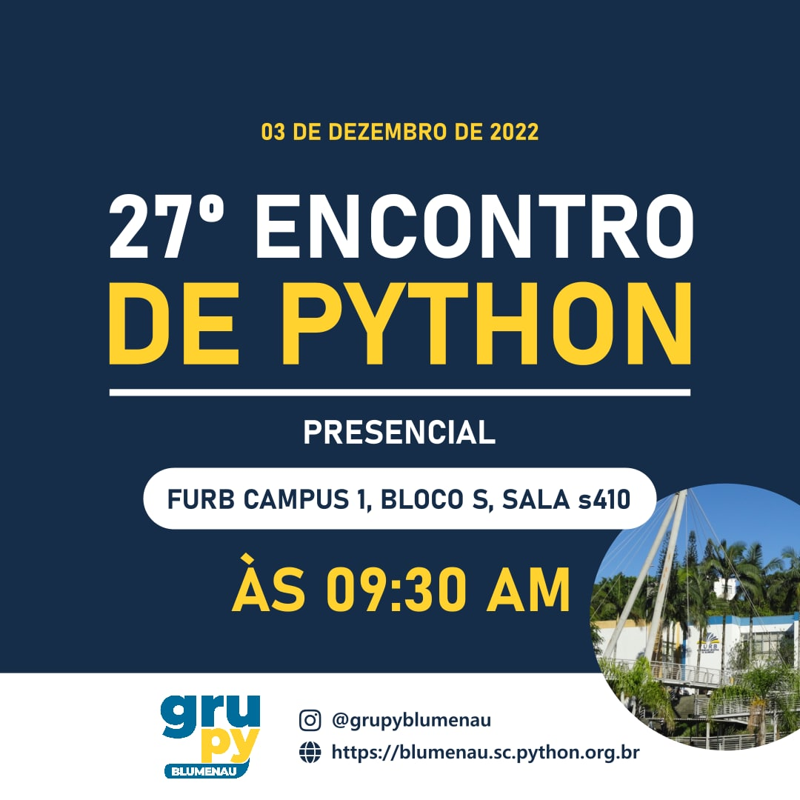

# Templates de banners do Grupy Blumenau

Templates de artes/banners criados para divulgar eventos. Todos os templates contídos neste repositório estão no formato **SVG** e foram criados para serem utilizados com [**Inkscape**](https://inkscape.org/pt-br/).

**Antes de tudo**, é importante salientar: os templates deste repositório são apenas para guardar um ponto de partida para a criação das artes do grupo. Fique a vontade para usar sua liberdade criativa para inovar em cada novo banner publicado 😁

## Tutoriais

### Como usar

1. Faça download do [Inkscape](https://inkscape.org/release/)
2. Instale as fontes contidas na pasta `/fonts`
3. Abra os arquivos em `/templates` usando o Inkscape
4. Use sua criatividade para modificar a vontade e criar novas artes

### Adicionando novos templates

Antes de enviar os templates, é importante se atentar para alguns detalhes:

- Cuide para que o template possua guias/linhas para ajudar a manter o padrão consistente durante a edição
- Sempre mantenha as redes sociais do GruPy em algum lugar no template
- Busque sempre manter a mesma paleta de cores dos templates já existentes
- Prefira fontes com licenças abertas
- Não esqueça de adicionar as fontes usadas na pasta de fontes do repositório

Dado isto, tome o mesmo procedimento padrão para contribuir com qualquer projeto no GitHub:

1. Faça um [fork](https://github.com/pythonbnu/banners-templates/fork) e clone localmente
2. Crie um [pull request](https://github.com/pythonbnu/banners-templates/pulls)
3. Aguarde a revisão e merge

## Templates existentes

| Arquivo | Exemplo |
|-|-|
| [encontro-presencial.svg](./templates/encontro-presencial.svg) |  |
